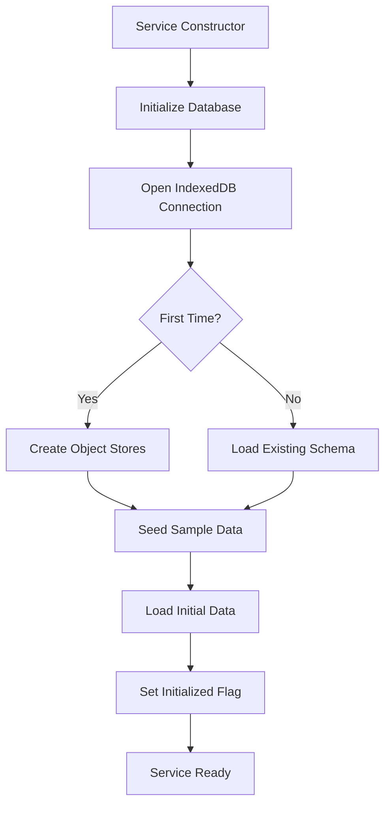

# LocalStorageService Documentation

## 📚 Overview

The `LocalStorageService` is a comprehensive data persistence layer for the Learning Notebook application. It provides a robust, type-safe interface for managing notes, notebooks, tags, and user learning data using IndexedDB for client-side storage.

## 🎯 Key Features

- **🗃️ Full CRUD Operations** - Create, read, update, delete for all entities
- **🔍 Advanced Search Engine** - Full-text search with highlighting and filtering
- **📊 Real-time Analytics** - Dashboard statistics computed from actual data
- **⚡ Reactive Data Flow** - RxJS observables for real-time UI updates
- **🌱 Automatic Data Seeding** - Sample data for immediate application functionality
- **🔒 Type Safety** - Full TypeScript integration with data models
- **📈 Performance Optimized** - Proper IndexedDB indexing and caching strategies

## 🏗️ Architecture

### Data Layer Stack
```
┌─────────────────────────────────┐
│        Angular Components       │
├─────────────────────────────────┤
│      LocalStorageService       │
├─────────────────────────────────┤
│         IndexedDB API           │
├─────────────────────────────────┤
│       Browser Storage           │
└─────────────────────────────────┘
```

### Design Principles

1. **Reactive First** - All data operations return observables for real-time updates
2. **Type Safety** - Comprehensive TypeScript interfaces prevent runtime errors
3. **Performance** - Efficient indexing and caching strategies
4. **Scalability** - Designed to handle large datasets with pagination support
5. **Offline First** - All data stored locally for offline functionality

## 📊 Data Schema

### Core Entities

```typescript
Note {
  id: string              // Unique identifier
  title: string           // Note title
  content: NoteBlock[]    // Rich content blocks
  notebookId: string      // Parent notebook reference
  tags: string[]          // Associated tags
  type: NoteType          // Content classification
  status: NoteStatus      // Publishing status
  metadata: NoteMetadata  // Additional properties
  // ... timestamps, flags, etc.
}

Notebook {
  id: string              // Unique identifier
  name: string            // Display name
  description?: string    // Optional description
  color: string           // Theme color (hex)
  emoji?: string          // Display emoji
  // ... organization, timestamps, etc.
}
```

### Content Blocks System

The service implements a flexible block-based content system:

```typescript
NoteBlock {
  id: string              // Block identifier
  type: BlockType         // heading|text|code|list|etc.
  content: any            // Type-specific content
  position: number        // Order in note
  // ... timestamps, metadata
}
```

Supported block types:
- **Text** - Rich text with formatting
- **Heading** - H1-H6 headers
- **Code** - Syntax-highlighted code blocks
- **List** - Bullet/numbered/todo lists
- **Quote** - Blockquotes
- **Table** - Data tables
- **Image** - Media embeds
- **Math** - LaTeX formulas

## 🔧 Service Architecture

### Initialization Flow



### Reactive Data Flow

```typescript
// Data flows through BehaviorSubjects for real-time updates
private notesSubject = new BehaviorSubject<Note[]>([]);
public notes$ = this.notesSubject.asObservable();

// Dashboard stats computed from multiple streams
public dashboardStats$ = combineLatest([
  this.notes$,
  this.notebooks$,
  this.studySessions$
]).pipe(
  map(([notes, notebooks, sessions]) => 
    this.calculateDashboardStats(notes, notebooks, sessions)
  )
);
```

## 📝 API Reference

### Notes Operations

#### Create Note
```typescript
async createNote(noteData: Omit<Note, 'id' | 'createdAt' | 'updatedAt'>): Promise<Note>
```
Creates a new note with auto-generated ID and timestamps.

**Example:**
```typescript
const note = await storageService.createNote({
  title: 'My New Note',
  content: [
    {
      id: '1',
      type: 'heading',
      content: { text: 'Introduction', level: 1 },
      position: 1,
      createdAt: new Date(),
      updatedAt: new Date()
    }
  ],
  notebookId: 'notebook-123',
  tags: ['javascript', 'learning'],
  type: 'text',
  status: 'draft',
  metadata: { completionStatus: 0 },
  isBookmarked: false,
  isPinned: false,
  wordCount: 12,
  readingTimeMinutes: 1
});
```

#### Get Notes
```typescript
// Single note
async getNote(id: string): Promise<Note | null>

// All notes
async getAllNotes(): Promise<Note[]>

// Notes by notebook
async getNotesByNotebook(notebookId: string): Promise<Note[]>

// Recent notes
async getRecentNotes(limit = 10): Promise<Note[]>
```

#### Update Note
```typescript
async updateNote(id: string, updates: Partial<Omit<Note, 'id' | 'createdAt'>>): Promise<Note | null>
```

**Example:**
```typescript
await storageService.updateNote('note-123', {
  title: 'Updated Title',
  tags: ['javascript', 'angular', 'signals'],
  metadata: { completionStatus: 85 }
});
```

#### Delete Note
```typescript
async deleteNote(id: string): Promise<boolean>
```

### Notebook Operations

#### Create Notebook
```typescript
async createNotebook(notebookData: Omit<Notebook, 'id' | 'createdAt' | 'updatedAt'>): Promise<Notebook>
```

**Example:**
```typescript
const notebook = await storageService.createNotebook({
  name: 'Web Development',
  description: 'Frontend and backend technologies',
  color: '#3b82f6',
  emoji: '💻',
  position: 1,
  isPrivate: false,
  tags: ['web', 'development'],
  noteCount: 0
});
```

#### Get Notebooks
```typescript
async getNotebook(id: string): Promise<Notebook | null>
async getAllNotebooks(): Promise<Notebook[]>
```

#### Update/Delete Notebooks
```typescript
async updateNotebook(id: string, updates: Partial<Omit<Notebook, 'id' | 'createdAt'>>): Promise<Notebook | null>
async deleteNotebook(id: string): Promise<boolean>
```

### Search System

#### Advanced Search
```typescript
async searchNotes(query: SearchQuery): Promise<SearchResult[]>
```

**SearchQuery Interface:**
```typescript
interface SearchQuery {
  text?: string;              // Full-text search
  tags?: string[];            // Filter by tags
  notebooks?: string[];       // Filter by notebooks
  dateRange?: {               // Date range filter
    start: Date;
    end: Date;
  };
  type?: NoteType[];          // Filter by note type
  status?: NoteStatus[];      // Filter by status
  sortBy?: 'relevance' | 'created' | 'updated' | 'title';
  sortOrder?: 'asc' | 'desc';
}
```

**Example Search:**
```typescript
const results = await storageService.searchNotes({
  text: 'angular signals',
  tags: ['javascript', 'angular'],
  type: ['code', 'text'],
  status: ['published'],
  sortBy: 'relevance'
});

// Results include highlighting and snippets
results.forEach(result => {
  console.log(`Found: ${result.note.title}`);
  console.log(`Score: ${result.score}`);
  console.log(`Snippet: ${result.snippet}`);
  console.log(`Highlights:`, result.highlights);
});
```

### Dashboard Analytics

#### Real-time Stats
```typescript
// Observable that updates automatically
public dashboardStats$: Observable<DashboardStats>

interface DashboardStats {
  totalNotes: number;         // Total note count
  totalNotebooks: number;     // Total notebook count
  recentActivity: number;     // Notes created/updated this week
  weeklyGoal: number;         // Learning goal target
  completedToday: number;     // Study sessions today
  aiSuggestions: number;      // Available AI insights
  streakDays: number;         // Consecutive learning days
}
```

**Usage in Components:**
```typescript
@Component({...})
export class DashboardComponent {
  private storageService = inject(LocalStorageService);
  
  // Convert observable to signal for templates
  public stats = toSignal(this.storageService.dashboardStats$, {
    initialValue: { /* default values */ }
  });
}
```

## 🔍 Search Engine Details

### Full-Text Search Algorithm

The search engine implements a sophisticated scoring system:

1. **Title Matches** - Highest priority (score: 10 points)
2. **Content Matches** - Medium priority (score: 5 points)
3. **Tag Matches** - Bonus scoring (score: 3 points per tag)
4. **Exact vs Partial** - Exact matches score higher

### Search Highlighting

```typescript
interface SearchHighlight {
  blockId: string;    // Which content block
  text: string;       // Full text of block
  start: number;      // Highlight start position
  end: number;        // Highlight end position
}
```

### Search Performance

- **Indexed Fields** - Title, content text, tags, dates
- **Query Optimization** - Early filtering by type/status
- **Result Limiting** - Configurable result limits
- **Snippet Generation** - Context-aware text extraction

## 💾 Storage Implementation

### IndexedDB Schema

```javascript
// Object Stores
notes: {
  keyPath: 'id',
  indexes: ['notebookId', 'createdAt', 'updatedAt', 'tags', 'type', 'title', 'status']
}

notebooks: {
  keyPath: 'id',
  indexes: ['name', 'parentId', 'createdAt']
}

tags: {
  keyPath: 'id',
  indexes: ['name', 'count']
}

studySessions: {
  keyPath: 'id',
  indexes: ['noteId', 'startTime', 'activity']
}
```

### Storage Quotas

The service monitors storage usage:

```typescript
// Future implementation
interface StorageQuota {
  used: number;       // Bytes used
  available: number;  // Bytes available  
  total: number;      // Total quota
  percentUsed: number;
}
```

## 🌱 Sample Data

### Automatic Seeding

On first run, the service creates sample data:

- **4 Notebooks** - Frontend, Backend, Data Science, UI/UX
- **4 Sample Notes** - Realistic content with proper block structure
- **Proper Relationships** - Notes linked to appropriate notebooks
- **Rich Metadata** - Tags, completion status, reading time

### Seed Data Structure

```typescript
// Sample notebooks with realistic topics
'Frontend Development' → Color: #3b82f6, Emoji: ⚛️
'Backend Development'  → Color: #10b981, Emoji: 🔧  
'Data Science'        → Color: #8b5cf6, Emoji: 📊
'UI/UX Design'        → Color: #ef4444, Emoji: 🎨

// Sample notes with block-based content
'Angular Signals Deep Dive'      → Frontend (85% complete)
'Theme System Implementation'    → UI/UX (65% complete)
'Machine Learning Fundamentals'  → Data Science (45% complete)
'Database Design Patterns'      → Backend (90% complete)
```

## ⚡ Performance Considerations

### Indexing Strategy

```typescript
// Optimized for common query patterns
Primary Indexes:
- notes.notebookId     // Filter by notebook
- notes.createdAt      // Sort by creation date
- notes.updatedAt      // Sort by modification
- notes.tags           // Multi-entry for tag filtering

Secondary Indexes:
- notes.type           // Filter by content type
- notes.status         // Filter by publishing status
- notebooks.name       // Sort notebooks alphabetically
```

### Memory Management

- **Lazy Loading** - Only load data when needed
- **Reactive Caching** - BehaviorSubjects cache latest data
- **Batch Operations** - Efficient bulk data operations
- **Connection Pooling** - Reuse IndexedDB connections

### Query Optimization

```typescript
// Efficient notebook-notes relationship
async getNotesByNotebook(notebookId: string): Promise<Note[]> {
  // Uses index for O(log n) lookup instead of O(n) scan
  return this.getItemsByIndex('notes', 'notebookId', notebookId);
}

// Optimized recent notes query
async getRecentNotes(limit = 10): Promise<Note[]> {
  const notes = await this.getAllNotes();
  return notes
    .sort((a, b) => b.updatedAt.getTime() - a.updatedAt.getTime())
    .slice(0, limit); // Only take what we need
}
```

## 🔮 Future Enhancements

### Planned Features

1. **Offline Sync** - Merge changes when back online
2. **Data Export** - JSON/Markdown export functionality  
3. **Backup/Restore** - Full data backup capabilities
4. **Query Caching** - Cache frequent search results
5. **Bulk Operations** - Efficient batch import/export
6. **Full-Text Indexing** - More sophisticated search
7. **Data Compression** - Reduce storage footprint
8. **Change Tracking** - Detailed audit logs

### Scalability Roadmap

```typescript
// Phase 1: Current (Local Storage)
✅ IndexedDB with reactive observables
✅ Full CRUD operations
✅ Basic search engine

// Phase 2: Enhanced Local (Next)
🔄 Query result caching
🔄 Advanced full-text search
🔄 Data compression

// Phase 3: Hybrid (Future)
📅 Cloud synchronization
📅 Conflict resolution
📅 Multi-device support

// Phase 4: Distributed (Long-term)
📅 Real-time collaboration
📅 Distributed caching
📅 Advanced analytics
```

## 🧪 Testing Strategy

### Unit Tests

```typescript
describe('LocalStorageService', () => {
  it('should create notes with proper structure');
  it('should update notes and refresh cache');
  it('should search notes with accurate scoring');
  it('should calculate dashboard stats correctly');
  it('should handle IndexedDB errors gracefully');
});
```

### Integration Tests

```typescript
describe('Dashboard Integration', () => {
  it('should display real note counts');
  it('should update when notes are created');
  it('should show recent notes in correct order');
});
```

## 🚀 Getting Started

### Basic Usage

```typescript
@Component({...})
export class MyComponent {
  private storage = inject(LocalStorageService);

  async ngOnInit() {
    // Wait for initialization
    while (!this.storage.isInitialized()) {
      await new Promise(resolve => setTimeout(resolve, 100));
    }

    // Now safe to use
    const notes = await this.storage.getAllNotes();
    console.log(`Found ${notes.length} notes`);
  }

  // Reactive usage
  public notes$ = this.storage.notes$;
  public stats$ = this.storage.dashboardStats$;
}
```

### Error Handling

```typescript
try {
  const note = await this.storage.createNote(noteData);
  console.log('Note created:', note.id);
} catch (error) {
  console.error('Failed to create note:', error);
  // Handle error appropriately
}
```

## 📄 License

Part of the Learning Notebook application - MIT License.

---

**📚 This service provides the foundation for a robust, offline-first learning management system with real-time updates and comprehensive search capabilities.**